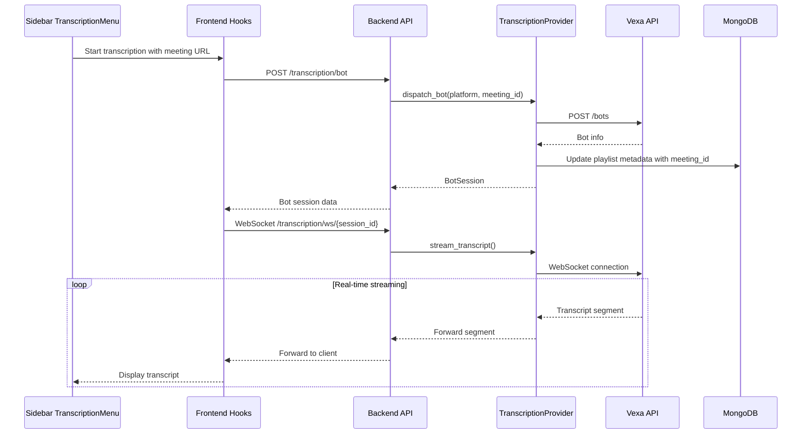

# Vexa Transcription Provider Integration

## Overview

This plan integrates Vexa as the transcription backend through a provider abstraction layer. The backend will proxy all Vexa interactions (including WebSocket streaming) to maintain a consistent API and support both hosted and self-hosted deployments.

## Architecture



## Key Files to Modify/Create

### Backend

| File | Action | Purpose |

|------|--------|---------|

| [`backend/src/dna/transcription_providers/transcription_provider_base.py`](backend/src/dna/transcription_providers/transcription_provider_base.py) | Modify | Define abstract interface for transcription operations |

| `backend/src/dna/transcription_providers/vexa.py` | Create | Vexa-specific implementation with REST + WebSocket |

| `backend/src/dna/models/transcription.py` | Create | Pydantic models for bot sessions, transcript segments, status |

| [`backend/src/main.py`](backend/src/main.py) | Modify | Add transcription endpoints including WebSocket |

### Frontend

| File | Action | Purpose |

|------|--------|---------|

| `frontend/packages/core/src/interfaces.ts` | Modify | Add transcription-related types |

| `frontend/packages/core/src/apiHandler.ts` | Modify | Add transcription API methods |

| `frontend/packages/app/src/hooks/useTranscription.ts` | Create | Hook for transcription state management |

| `frontend/packages/app/src/components/TranscriptionMenu.tsx` | Create | Sidebar transcription control panel |

| [`frontend/packages/app/src/components/Sidebar.tsx`](frontend/packages/app/src/components/Sidebar.tsx) | Modify | Integrate TranscriptionMenu component |

## Implementation Details

### 1. Backend Transcription Provider

Extend `TranscriptionProviderBase` with Vexa implementation:

```python
class TranscriptionProviderBase:
    async def dispatch_bot(self, platform: str, meeting_id: str, passcode: str = None) -> BotSession
    async def stop_bot(self, platform: str, meeting_id: str) -> bool
    async def get_bot_status(self, platform: str, meeting_id: str) -> BotStatus
    async def get_transcript(self, platform: str, meeting_id: str) -> list[TranscriptSegment]
    async def stream_transcript(self, platform: str, meeting_id: str) -> AsyncGenerator[TranscriptSegment]
```

Configuration via environment variables:

- `VEXA_API_URL` - Base URL (defaults to `https://api.cloud.vexa.ai` for hosted)
- `VEXA_API_KEY` - API key for authentication

### 2. Backend API Endpoints

New endpoints under `/transcription` tag:

| Method | Endpoint | Description |

|--------|----------|-------------|

| POST | `/transcription/bot` | Dispatch bot to meeting, saves meeting_id to playlist |

| DELETE | `/transcription/bot/{platform}/{meeting_id}` | Stop bot |

| GET | `/transcription/bot/{platform}/{meeting_id}/status` | Get bot status |

| GET | `/transcription/transcript/{platform}/{meeting_id}` | Get full transcript |

| WebSocket | `/transcription/ws/{platform}/{meeting_id}` | Real-time transcript stream |

### 3. Frontend Transcription Hook

The `useTranscription` hook will manage:

- Bot dispatch with automatic playlist metadata update
- WebSocket connection lifecycle
- Real-time transcript accumulation
- Status polling/updates

### 4. Sidebar Transcription Menu UI

Replace the placeholder "Transcribing" button in the Sidebar footer with a `TranscriptionMenu` component featuring:

- Meeting URL input field (with platform auto-detection from URL)
- Start/Stop transcription button
- Status indicator (idle, joining, transcribing, error)
- Expandable live transcript panel
- Integration with playlist metadata to persist meeting_id

### 5. Meeting URL Parsing

Support parsing meeting URLs to extract platform and meeting ID:

- Google Meet: `https://meet.google.com/xxx-xxxx-xxx` -> platform: `google_meet`, id: `xxx-xxxx-xxx`
- Microsoft Teams: Extract from Teams meeting link

### 6. Playlist Metadata Integration

When dispatching a bot, automatically update the playlist metadata:

```python
await storage_provider.upsert_playlist_metadata(
    playlist_id,
    PlaylistMetadataUpdate(meeting_id=native_meeting_id)
)
```

## Configuration

Add to docker-compose for local development:

- Vexa container (already exists in `docker-compose.vexa.yml`)
- Environment variables for Vexa connection

## Testing Strategy

- Unit tests for Vexa provider with mocked HTTP/WebSocket
- Integration tests for API endpoints
- Frontend component tests for TranscriptionMenu