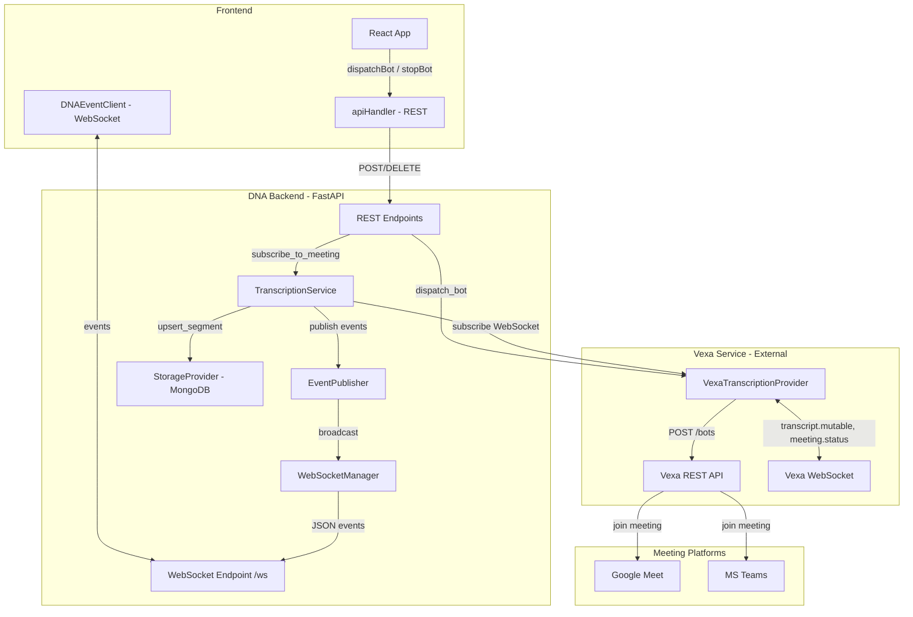
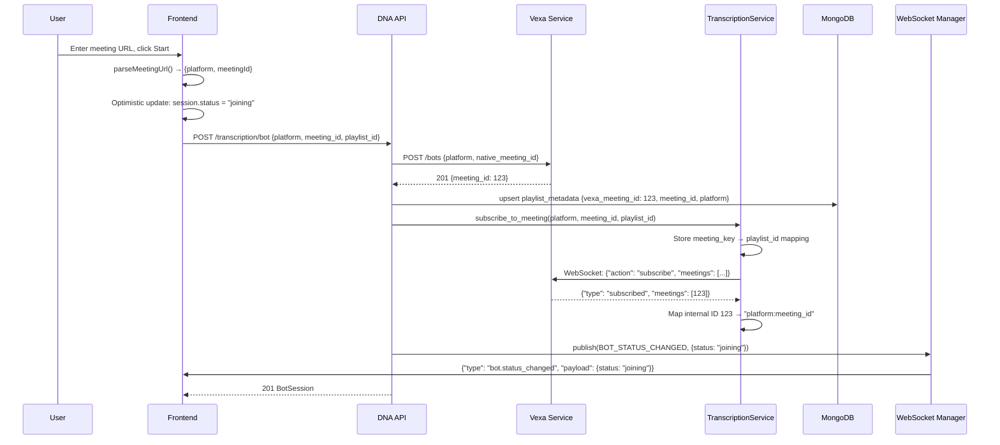
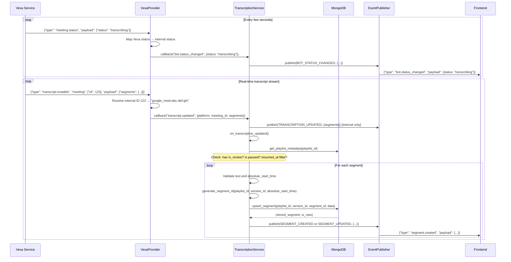
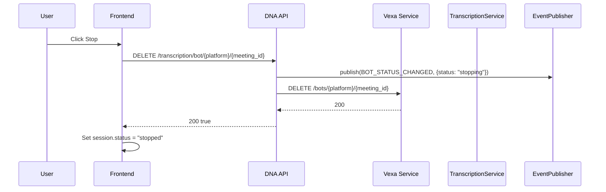
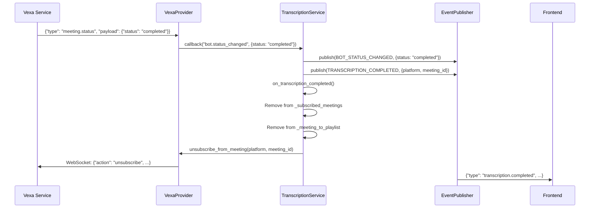
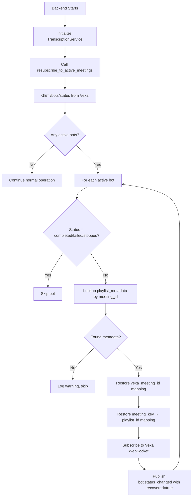

# Transcription Pipeline Documentation

This document describes the real-time transcription pipeline that integrates DNA with Vexa for meeting transcription, segment persistence, and event-driven UI updates.

## Table of Contents

1. [Overview](#overview)
2. [System Architecture](#system-architecture)
3. [Layer-by-Layer Breakdown](#layer-by-layer-breakdown)
4. [Bot Lifecycle Management](#bot-lifecycle-management)
5. [Event System](#event-system)
6. [Data Flow](#data-flow)
7. [Pause and Resume](#pause-and-resume)
8. [Recovery Mechanisms](#recovery-mechanisms)
9. [Data Models](#data-models)
10. [API Reference](#api-reference)
11. [Configuration](#configuration)
12. [Testing](#testing)
13. [Troubleshooting](#troubleshooting)
14. [Architecture Decision Records](#architecture-decision-records)

---

## Overview

The transcription pipeline enables real-time meeting transcription by:

1. **Dispatching bots** to join meetings on Google Meet or Microsoft Teams
2. **Receiving real-time transcripts** via WebSocket from the Vexa transcription service
3. **Persisting segments** to MongoDB with deterministic, hash-based unique IDs
4. **Broadcasting events** to connected frontend clients via WebSocket
5. **Supporting pause/resume** of segment storage without stopping the bot
6. **Recovering gracefully** from backend restarts by resubscribing to active meetings

```
┌─────────────────┐     ┌─────────────────┐     ┌─────────────────┐
│    Frontend     │◀───▶│    DNA API      │────▶│     MongoDB     │
│     (React)     │ WS  │    (FastAPI)    │     │    (segments)   │
└─────────────────┘     └────────┬────────┘     └─────────────────┘
                                 │
                                 │ WebSocket
                                 ▼
                        ┌─────────────────┐
                        │      Vexa       │────▶ Google Meet / Teams
                        │  (transcribe)   │
                        └─────────────────┘
```

---

## System Architecture

### High-Level Architecture



### Layer Interaction Summary

The system is organized into six distinct layers, each with a clear responsibility. Every layer communicates through well-defined interfaces:

| Layer | Component | Communicates With | Protocol |
|-------|-----------|-------------------|----------|
| **Frontend UI** | React components, hooks | DNA API, WebSocket Manager | REST + WebSocket |
| **API** | FastAPI endpoints | TranscriptionService, Vexa Provider, Storage Provider | Function calls |
| **Service** | TranscriptionService | Vexa Provider, Storage Provider, EventPublisher | Function calls, callbacks |
| **Provider** | VexaTranscriptionProvider | Vexa external service | HTTP REST + WebSocket |
| **Storage** | MongoDBStorageProvider | MongoDB | Database driver |
| **Event** | EventPublisher + WebSocketManager | Frontend clients | In-memory pub/sub + WebSocket |

---

## Layer-by-Layer Breakdown

### Layer 1: Frontend (React)

The frontend never captures audio directly. It dispatches bots to meetings and receives transcription results via events.

**Key Files:**
- `frontend/packages/core/src/eventClient.ts` — `DNAEventClient` WebSocket client
- `frontend/packages/core/src/apiHandler.ts` — REST API client
- `frontend/packages/core/src/interfaces.ts` — Shared TypeScript types
- `frontend/packages/app/src/hooks/useTranscription.ts` — Bot lifecycle hook
- `frontend/packages/app/src/hooks/useSegments.ts` — Segment data hook
- `frontend/packages/app/src/hooks/useDNAEvents.ts` — Event subscription hooks
- `frontend/packages/app/src/hooks/usePlaylistMetadata.ts` — Playlist metadata hook
- `frontend/packages/app/src/components/TranscriptionMenu.tsx` — Bot dispatch/stop UI
- `frontend/packages/app/src/components/TranscriptPanel.tsx` — Segment display UI
- `frontend/packages/app/src/contexts/EventContext.tsx` — WebSocket connection provider

**How it works:**

1. The `EventProvider` context creates a `DNAEventClient` and connects to the backend WebSocket at `/ws` on mount.
2. The `useTranscription` hook manages bot state. When the user enters a meeting URL:
   - `parseMeetingUrl()` extracts the `platform` and `meetingId`
   - `dispatchBot()` sends a `POST /transcription/bot` via `apiHandler`
   - An optimistic local session is created with `status: "joining"`
   - On success the session is updated with the server response
3. The hook subscribes to `bot.status_changed` events via `eventClient.subscribe()` and updates React state on each status change.
4. The `useSegments` hook subscribes to `segment.created` and `segment.updated` events, filtering by `playlistId` and `versionId`, and updates the React Query cache.
5. When the user stops transcription, `stopBot()` calls `DELETE /transcription/bot/{platform}/{meetingId}`.

**State management:**
- **React Query (TanStack Query)** for server state (bot status, segments, playlist metadata)
- **Local state** (`useState`) for the current `BotSession`
- **WebSocket events** update the React Query cache in real time

### Layer 2: API (FastAPI)

The API layer exposes REST endpoints and the WebSocket endpoint. It orchestrates the dispatch flow but delegates transcription processing to the service layer.

**Key File:** `backend/src/main.py`

**Endpoints:**

| Method | Path | Description |
|--------|------|-------------|
| `POST` | `/transcription/bot` | Dispatch a bot to a meeting |
| `DELETE` | `/transcription/bot/{platform}/{meeting_id}` | Stop a bot |
| `GET` | `/transcription/bot/{platform}/{meeting_id}/status` | Get current bot status |
| `GET` | `/transcription/transcript/{platform}/{meeting_id}` | Get full transcript |
| `GET` | `/transcription/segments/{playlist_id}/{version_id}` | Get stored segments |
| `WS` | `/ws` | Real-time event streaming |

**Dispatch flow in the API layer:**
1. Validate the `DispatchBotRequest`
2. Call `transcription_provider.dispatch_bot()` → Vexa REST API
3. Receive `BotSession` with `vexa_meeting_id`
4. Update `playlist_metadata` in MongoDB with `vexa_meeting_id`, `meeting_id`, `platform`
5. Call `transcription_service.subscribe_to_meeting()` to start receiving WebSocket events
6. Publish `bot.status_changed` event with status `"joining"`
7. Return `BotSession` (HTTP 201)

**WebSocket endpoint:**
The `/ws` endpoint accepts WebSocket connections, registers them with the `WebSocketManager`, and keeps them alive. The server sends events to clients but does not currently process incoming client messages (the connection is kept alive with `receive_text()` in a loop).

### Layer 3: Service (TranscriptionService)

The central orchestrator for transcription logic. It bridges the Vexa provider with storage and events.

**Key File:** `backend/src/dna/transcription_service.py`

**Responsibilities:**
- Manage the set of subscribed meetings (`_subscribed_meetings`)
- Maintain the mapping from `platform:meeting_id` to `playlist_id` (`_meeting_to_playlist`)
- Process raw Vexa events into stored segments
- Enforce pause/resume filtering
- Publish domain events
- Recover subscriptions on startup

**Internal state:**
```
_subscribed_meetings: set[str]          # e.g. {"google_meet:abc-def-ghi"}
_meeting_to_playlist: dict[str, int]    # e.g. {"google_meet:abc-def-ghi": 42}
```

**Key methods:**

| Method | Purpose |
|--------|---------|
| `init_providers()` | Lazy-initialize the transcription provider, storage provider, and event publisher |
| `subscribe_to_meeting(platform, meeting_id, playlist_id)` | Register a meeting subscription and connect to the Vexa WebSocket |
| `_on_vexa_event(event_type, payload)` | Callback invoked by the Vexa provider for every WebSocket message. Routes to `on_transcription_updated()` or publishes status/completion events |
| `on_transcription_updated(payload)` | Core segment processing: validate, check pause state, generate IDs, upsert to storage, publish events |
| `on_transcription_completed(payload)` | Clean up subscription state and unsubscribe from Vexa |
| `resubscribe_to_active_meetings()` | Recovery on startup: query Vexa for active bots, restore mappings, resubscribe |
| `close()` | Tear down provider connections and clear state |

### Layer 4: Transcription Provider (VexaTranscriptionProvider)

An abstraction over the Vexa external service. Handles both REST API calls and the persistent WebSocket connection.

**Key Files:**
- `backend/src/dna/transcription_providers/transcription_provider_base.py` — Abstract base class
- `backend/src/dna/transcription_providers/vexa.py` — Vexa implementation

**REST operations (via `httpx.AsyncClient`):**

| Vexa Endpoint | Provider Method | Description |
|---------------|-----------------|-------------|
| `POST /bots` | `dispatch_bot()` | Send a bot to join a meeting |
| `DELETE /bots/{platform}/{meeting_id}` | `stop_bot()` | Remove a bot from a meeting |
| `GET /meetings` | `get_bot_status()` | Poll for bot status |
| `GET /transcripts/{platform}/{meeting_id}` | `get_transcript()` | Fetch the full transcript |
| `GET /bots/status` | `get_active_bots()` | List running bots (for recovery) |

**WebSocket operations (via `websockets`):**

The provider maintains a single persistent WebSocket connection to Vexa at `wss://{vexa_host}/ws?api_key={key}`. All meeting subscriptions are multiplexed over this one connection.

**Outgoing messages:**
```json
{"action": "subscribe", "meetings": [{"platform": "google_meet", "native_id": "abc-def-ghi"}]}
{"action": "unsubscribe", "meetings": [{"platform": "google_meet", "native_id": "abc-def-ghi"}]}
```

**Incoming messages and handling:**

| Vexa Message Type | Handler Action |
|-------------------|----------------|
| `subscribed` | Map Vexa internal meeting IDs to `platform:native_id` keys via `_meeting_id_to_key`. Clear pending subscriptions. |
| `transcript.mutable` | Look up the `platform:native_id` from the internal meeting ID, invoke the `on_event` callback with `"transcript.updated"` and the segment data. |
| `meeting.status` | Map the Vexa status string to an internal status via `VEXA_STATUS_MAP`, invoke the callback with `"bot.status_changed"`. |
| `error` | Log the error. |
| `pong` | Ignored (keep-alive response). |

**Vexa Status Mapping:**

| Vexa Status | Internal Status |
|-------------|-----------------|
| `requested` | `joining` |
| `joining` | `joining` |
| `awaiting_admission` | `waiting_room` |
| `active` | `in_call` |
| `in_call` | `in_call` |
| `transcribing` | `transcribing` |
| `recording` | `transcribing` |
| `failed` | `failed` |
| `stopped` | `stopped` |
| `completed` | `completed` |
| `ended` | `completed` |

**Internal ID mapping:**

Vexa uses numeric internal meeting IDs in WebSocket messages, but DNA uses `platform:native_meeting_id` as the canonical key. The provider maintains `_meeting_id_to_key: dict[int, str]` which is populated from:
1. The `subscribed` response (maps returned IDs to pending subscription keys)
2. The `meeting.status` events (extracts platform and native_id from the meeting info)
3. Explicit registration via `register_meeting_id_mapping()` during recovery

### Layer 5: Storage (MongoDBStorageProvider)

Handles all persistence for playlist metadata and transcript segments.

**Key Files:**
- `backend/src/dna/storage_providers/storage_provider_base.py` — Abstract base class
- `backend/src/dna/storage_providers/mongodb.py` — MongoDB implementation

**Collections:**

| Collection | Purpose | Key Operations |
|------------|---------|----------------|
| `playlist_metadata` | Links playlists to meetings, versions, and pause state | `get_playlist_metadata()`, `upsert_playlist_metadata()`, `get_playlist_metadata_by_meeting_id()` |
| `segments` | Stores transcript segments | `upsert_segment()`, `get_segments()` |

**`upsert_segment()` behavior:**
- Uses `segment_id` as the unique key
- If a segment with the same `segment_id` exists, updates `text`, `speaker`, `absolute_end_time`, `vexa_updated_at`, and `updated_at`
- Returns `(StoredSegment, is_new: bool)` so the caller knows whether to emit `segment.created` or `segment.updated`

### Layer 6: Event System (EventPublisher + WebSocketManager)

The glue that connects backend processing to the frontend in real time.

**Key File:** `backend/src/dna/events/event_publisher.py`

```
┌────────────────────────────────────────────────────────────────┐
│                         EventPublisher                         │
├────────────────────────────────────────────────────────────────┤
│  subscribe(event_type, callback)  → unsubscribe function       │
│  subscribe_all(callback)          → unsubscribe function       │
│  publish(event_type, payload)     → broadcasts to:             │
│     ├── Internal subscribers (in-memory callbacks)             │
│     └── WebSocket clients (via WebSocketManager)               │
├────────────────────────────────────────────────────────────────┤
│                       WebSocketManager                         │
├────────────────────────────────────────────────────────────────┤
│  connect(websocket)     → Accept and register client           │
│  disconnect(websocket)  → Remove client from registry          │
│  broadcast(message)     → Send JSON to all connected clients   │
│  connection_count       → Number of active connections         │
└────────────────────────────────────────────────────────────────┘
```

**Broadcast flow:**
1. `publish()` is called with an `EventType` and a payload dict
2. All registered in-memory callbacks for that event type are invoked sequentially
3. All global subscribers (registered via `subscribe_all()`) are invoked
4. The `WebSocketManager` serializes `{"type": event_type, "payload": payload}` to JSON and sends it to every connected WebSocket client
5. Any client that fails to receive the message is automatically removed from the connection set

---

## Bot Lifecycle Management

### Bot States

The bot progresses through a defined set of states during its lifecycle:

```python
class BotStatusEnum(str, Enum):
    IDLE = "idle"
    JOINING = "joining"
    WAITING_ROOM = "waiting_room"
    IN_CALL = "in_call"
    TRANSCRIBING = "transcribing"
    FAILED = "failed"
    STOPPED = "stopped"
    COMPLETED = "completed"
```

### State Machine

```
                    ┌──────────────────────────────────────────────┐
                    │                                              │
                    ▼                                              │
    ┌──────┐   ┌─────────┐   ┌──────────────┐   ┌─────────┐   ┌─────────────┐
    │ idle │──▶│ joining │──▶│ waiting_room │──▶│ in_call │──▶│transcribing │
    └──────┘   └─────────┘   └──────────────┘   └─────────┘   └─────────────┘
                    │              │                  │              │
                    │              │                  │              │
                    ▼              ▼                  ▼              ▼
               ┌────────┐   ┌────────┐          ┌────────┐    ┌───────────┐
               │ failed │   │ failed │          │stopped │    │ completed │
               └────────┘   └────────┘          └────────┘    └───────────┘
```

### State Descriptions

| State | Description | Triggered By |
|-------|-------------|--------------|
| `idle` | No bot is active. The default/initial state. | Bot not dispatched, or session cleared. |
| `joining` | Bot has been dispatched and is attempting to join the meeting. | `POST /transcription/bot` response. Vexa statuses `requested` and `joining` map here. |
| `waiting_room` | Bot is in the meeting's waiting/lobby room, awaiting admission by a meeting participant. | Vexa status `awaiting_admission`. A toast notification is shown to the user. |
| `in_call` | Bot has joined the meeting but transcription has not started yet. | Vexa statuses `active` and `in_call`. The waiting room toast is dismissed. |
| `transcribing` | Bot is actively transcribing audio. Segments are being received and stored. | Vexa statuses `transcribing` and `recording`. |
| `failed` | An error occurred. The bot could not join or encountered an unrecoverable error. | Vexa status `failed`. Triggers `transcription.error` event. |
| `stopped` | The user manually stopped the bot. | User calls `DELETE /transcription/bot/{platform}/{meeting_id}`. Triggers `transcription.error` event (terminal state). |
| `completed` | The meeting ended naturally and transcription is finished. | Vexa statuses `completed` and `ended`. Triggers `transcription.completed` event. |

### Lifecycle: Dispatch (Start)



### Lifecycle: Active Transcription



### Lifecycle: Stop (User-Initiated)



### Lifecycle: Completion (Meeting Ends)



### Lifecycle: Failure

When Vexa reports a `failed` status:
1. The `VexaTranscriptionProvider` maps the Vexa status to `"failed"`
2. `TranscriptionService._on_vexa_event()` publishes `BOT_STATUS_CHANGED` with `status: "failed"`
3. Since `"failed"` is a terminal status, it also publishes `TRANSCRIPTION_ERROR`
4. `on_transcription_completed()` is called to clean up subscription state
5. The frontend receives the events and updates the UI accordingly

### Frontend Lifecycle Behaviors

The `useTranscription` hook implements several UX behaviors tied to status transitions:

- **Optimistic joining:** When `dispatchBot()` is called, a local session is created immediately with `status: "joining"` before the API responds.
- **Waiting room toast:** When status transitions to `waiting_room`, a warning toast is shown: *"The transcription agent is waiting to be admitted to the call."* The toast is automatically dismissed when status moves to `in_call` or `transcribing`.
- **Recovery detection:** On mount, if `playlistMetadata` has a `meeting_id` and `platform` but no local session exists, the hook fetches the bot status from the API. If the status is active, it creates a local session to resume the UI state.
- **Event-driven updates:** The hook subscribes to `bot.status_changed` events and matches them by `platform + meeting_id` or `playlist_id`.

---

## Event System

### Event Type Definitions

All events are defined in `backend/src/dna/events/event_types.py`:

```python
class EventType(str, Enum):
    TRANSCRIPTION_SUBSCRIBE = "transcription.subscribe"
    TRANSCRIPTION_STARTED = "transcription.started"
    TRANSCRIPTION_UPDATED = "transcription.updated"
    TRANSCRIPTION_COMPLETED = "transcription.completed"
    TRANSCRIPTION_ERROR = "transcription.error"
    SEGMENT_CREATED = "segment.created"
    SEGMENT_UPDATED = "segment.updated"
    BOT_STATUS_CHANGED = "bot.status_changed"
    PLAYLIST_UPDATED = "playlist.updated"
    VERSION_UPDATED = "version.updated"
    DRAFT_NOTE_UPDATED = "draft_note.updated"
```

The frontend `EventType` union mirrors the subset of events that are broadcast to clients:

```typescript
export type EventType =
  | 'segment.created'
  | 'segment.updated'
  | 'playlist.updated'
  | 'version.updated'
  | 'bot.status_changed'
  | 'transcription.completed'
  | 'transcription.error';
```

### Complete Event Reference

#### `bot.status_changed`

Emitted whenever the bot's status changes throughout its lifecycle.

| Property | Details |
|----------|---------|
| **Publisher** | API layer (on dispatch/stop), `TranscriptionService._on_vexa_event()` (on Vexa status updates), `resubscribe_to_active_meetings()` (on recovery) |
| **Consumer** | Frontend `useTranscription` hook via `eventClient.subscribe('bot.status_changed', ...)` |
| **Trigger** | Vexa `meeting.status` WebSocket message, API dispatch/stop calls, recovery resubscription |
| **Payload** | `{platform: string, meeting_id: string, playlist_id?: number, status: string, recovered?: boolean, timestamp?: string}` |
| **Downstream effects** | Frontend updates `BotSession` state; React Query cache for `['botStatus', platform, meetingId]` is updated; toast notifications for `waiting_room` status |

#### `segment.created`

Emitted when a new transcript segment is persisted for the first time.

| Property | Details |
|----------|---------|
| **Publisher** | `TranscriptionService.on_transcription_updated()` when `upsert_segment()` returns `is_new=True` |
| **Consumer** | Frontend `useSegments` hook via `eventClient.subscribeToSegmentEvents()` |
| **Trigger** | A new Vexa `transcript.mutable` segment with a `segment_id` not yet in MongoDB |
| **Payload** | `{segment_id: string, playlist_id: number, version_id: number, text: string, speaker: string, absolute_start_time: string, absolute_end_time: string}` |
| **Downstream effects** | Frontend appends the segment to the displayed transcript list |

#### `segment.updated`

Emitted when an existing segment's text or speaker is updated.

| Property | Details |
|----------|---------|
| **Publisher** | `TranscriptionService.on_transcription_updated()` when `upsert_segment()` returns `is_new=False` |
| **Consumer** | Frontend `useSegments` hook via `eventClient.subscribeToSegmentEvents()` |
| **Trigger** | A Vexa `transcript.mutable` segment with the same `segment_id` as an existing MongoDB document (the segment's text or speaker was refined by Vexa) |
| **Payload** | Same as `segment.created` |
| **Downstream effects** | Frontend replaces the matching segment in the transcript list |

#### `transcription.completed`

Emitted when a meeting ends naturally and transcription is finished.

| Property | Details |
|----------|---------|
| **Publisher** | `TranscriptionService._on_vexa_event()` when status is `"completed"` |
| **Consumer** | Frontend (via WebSocket broadcast) |
| **Trigger** | Vexa `meeting.status` with status `completed` or `ended` |
| **Payload** | `{platform: string, meeting_id: string, status: string, timestamp?: string}` |
| **Downstream effects** | `on_transcription_completed()` cleans up subscriptions and mappings. Frontend can finalize the transcript view. |

#### `transcription.error`

Emitted when a transcription session terminates due to failure or manual stop.

| Property | Details |
|----------|---------|
| **Publisher** | `TranscriptionService._on_vexa_event()` when status is `"failed"` or `"stopped"` |
| **Consumer** | Frontend (via WebSocket broadcast) |
| **Trigger** | Vexa `meeting.status` with status `failed` or `stopped` |
| **Payload** | `{platform: string, meeting_id: string, status: string, timestamp?: string}` |
| **Downstream effects** | Same cleanup as `transcription.completed`. Frontend can show error state. |

#### `transcription.updated` (Internal Only)

An internal event not broadcast to the frontend. Used to signal that raw transcript data has arrived.

| Property | Details |
|----------|---------|
| **Publisher** | `TranscriptionService._on_vexa_event()` when event type is `"transcript.updated"` |
| **Consumer** | Internal subscribers only |
| **Trigger** | Vexa `transcript.mutable` WebSocket message |
| **Payload** | `{platform: string, meeting_id: string, segments: list, payload: dict}` |
| **Downstream effects** | `on_transcription_updated()` is called to process and persist segments |

#### `playlist.updated`

Emitted when playlist metadata changes.

| Property | Details |
|----------|---------|
| **Publisher** | API layer when playlist metadata is modified |
| **Consumer** | Frontend `usePlaylistMetadata` hook |
| **Payload** | Playlist metadata fields |

#### `version.updated`

Emitted when version data changes.

| Property | Details |
|----------|---------|
| **Publisher** | API layer when version data is modified |
| **Consumer** | Frontend |
| **Payload** | Version fields |

#### `draft_note.updated`

Emitted when a draft note is updated.

| Property | Details |
|----------|---------|
| **Publisher** | API layer |
| **Consumer** | Frontend |
| **Payload** | Draft note fields |

### Event Interconnections

The following diagram shows how events chain together during a typical transcription session:

```
Vexa WebSocket Messages          Internal Events              Frontend Events
═══════════════════════          ═══════════════              ═══════════════

meeting.status ──────────┐
  (awaiting_admission)   │
                         ├──▶ BOT_STATUS_CHANGED ──────────▶ bot.status_changed
meeting.status ──────────┘       (waiting_room)                (waiting_room)
  (active)                                                        │
                                                                  ▼
                                                            [Toast shown]

meeting.status ──────────────▶ BOT_STATUS_CHANGED ──────────▶ bot.status_changed
  (transcribing)                  (transcribing)                (transcribing)
                                                                  │
                                                                  ▼
                                                            [Toast dismissed]

transcript.mutable ──────────▶ TRANSCRIPTION_UPDATED ──┐
                                  (internal)            │
                                                        ├──▶ SEGMENT_CREATED ──▶ segment.created
                                                        │    (per new segment)
                                                        │
                                                        └──▶ SEGMENT_UPDATED ──▶ segment.updated
                                                             (per existing segment)

meeting.status ──────────────▶ BOT_STATUS_CHANGED ──────────▶ bot.status_changed
  (completed)                    (completed)                    (completed)
         │                                                         │
         └───────────────────▶ TRANSCRIPTION_COMPLETED ─────▶ transcription.completed
                                                                   │
                                                                   ▼
                                                            [Cleanup subscriptions]

meeting.status ──────────────▶ BOT_STATUS_CHANGED ──────────▶ bot.status_changed
  (failed)                       (failed)                       (failed)
         │                                                         │
         └───────────────────▶ TRANSCRIPTION_ERROR ─────────▶ transcription.error
                                                                   │
                                                                   ▼
                                                            [Cleanup subscriptions]
```

### Vexa WebSocket Messages (External)

These are messages received from the external Vexa service, distinct from DNA's internal events:

| Vexa Message | DNA Handling | Emitted DNA Events |
|--------------|--------------|-------------------|
| `subscribed` | Maps internal meeting IDs to `platform:native_id` keys. Clears pending subscriptions. | None |
| `transcript.mutable` | Resolves meeting key, extracts segments, invokes callback. | `transcription.updated` (internal) → `segment.created` / `segment.updated` |
| `meeting.status` | Maps Vexa status to internal status, invokes callback. | `bot.status_changed`, and optionally `transcription.completed` or `transcription.error` |
| `error` | Logged. | None |
| `pong` | Ignored. | None |

### WebSocket Message Format

All events broadcast to the frontend follow this JSON format:

```json
{
  "type": "<event_type>",
  "payload": { ... }
}
```

**Example payloads:**

`bot.status_changed`:
```json
{
  "type": "bot.status_changed",
  "payload": {
    "platform": "google_meet",
    "meeting_id": "abc-def-ghi",
    "playlist_id": 42,
    "status": "transcribing",
    "recovered": false
  }
}
```

`segment.created`:
```json
{
  "type": "segment.created",
  "payload": {
    "segment_id": "a3f2b1c4d5e6f7a8",
    "playlist_id": 42,
    "version_id": 5,
    "text": "Hello, this is a test.",
    "speaker": "John Doe",
    "absolute_start_time": "2026-01-23T04:00:00.000Z",
    "absolute_end_time": "2026-01-23T04:00:05.000Z"
  }
}
```

`transcription.completed`:
```json
{
  "type": "transcription.completed",
  "payload": {
    "platform": "google_meet",
    "meeting_id": "abc-def-ghi",
    "status": "completed"
  }
}
```

### Frontend Event Subscriptions

The `DNAEventClient` provides typed subscription helpers:

| Method | Events Subscribed | Filter Options | Used By |
|--------|-------------------|----------------|---------|
| `subscribe(eventType, callback)` | Single event type | None (manual filtering) | `useTranscription` |
| `subscribeMultiple(eventTypes, callback)` | Multiple event types | None | Internal |
| `subscribeToSegmentEvents(callback, filter?)` | `segment.created`, `segment.updated` | `{playlistId?, versionId?}` | `useSegments` |
| `subscribeToBotStatusEvents(callback, filter?)` | `bot.status_changed` | `{platform?, meetingId?}` | Available for direct use |
| `onConnectionStateChange(callback)` | Connection state changes | None | `EventContext` |

---

## Data Flow

### Segment Processing Pipeline

When a `transcript.mutable` message arrives from Vexa, the `TranscriptionService.on_transcription_updated()` method processes it through several validation gates:

```
transcript.mutable arrives
        │
        ▼
┌──────────────────────────────┐
│ 1. Extract platform,         │
│    meeting_id, segments      │
│    from payload              │
└──────────────┬───────────────┘
               │
        ┌──────▼──────┐
        │ Has segments?│──No──▶ Return (debug log)
        └──────┬──────┘
               │ Yes
        ┌──────▼───────────────┐
        │ 2. Lookup playlist_id │
        │    from meeting_key   │
        │    mapping            │
        └──────┬───────────────┘
               │
        ┌──────▼──────────────┐
        │ Found playlist_id?  │──No──▶ Log warning, return
        └──────┬──────────────┘
               │ Yes
        ┌──────▼──────────────────────┐
        │ 3. Get playlist metadata     │
        │    from storage              │
        └──────┬──────────────────────┘
               │
        ┌──────▼────────────────────┐
        │ Has in_review version_id? │──No──▶ Log warning, return
        └──────┬────────────────────┘
               │ Yes
        ┌──────▼──────────────────┐
        │ 4. Is transcription     │
        │    paused?              │──Yes──▶ Log debug, return
        └──────┬──────────────────┘
               │ No
               ▼
        ┌──────────────────────────┐
        │ 5. For each segment:     │
        │                          │
        │  a. Has text? Has        │
        │     absolute_start_time? │──No──▶ Skip segment
        │                          │
        │  b. If resumed_at set:   │
        │     Is segment_time >=   │
        │     resumed_at?          │──No──▶ Skip segment
        │                          │
        │  c. Generate segment_id  │
        │     = SHA256(playlist_id │
        │     :version_id          │
        │     :absolute_start_time)│
        │     [:16]                │
        │                          │
        │  d. Upsert to MongoDB    │
        │                          │
        │  e. Publish              │
        │     SEGMENT_CREATED or   │
        │     SEGMENT_UPDATED      │
        └──────────────────────────┘
```

### Segment ID Generation

Segments are uniquely identified by a deterministic hash:

```python
segment_id = SHA256(f"{playlist_id}:{version_id}:{absolute_start_time}")[:16]
```

**Important:** Speaker is intentionally **excluded** from the hash key. Vexa's mutable transcription can reassign speakers as it refines the transcript. Using only the start time ensures updates to the same temporal moment are treated as updates rather than new segments.

This ensures:
- **Idempotent upserts:** The same audio moment always produces the same `segment_id`
- **Speaker reassignment:** If Vexa changes the speaker for a moment, the segment is updated, not duplicated
- **No coordination needed:** No sequence counters or distributed ID generation required

---

## Pause and Resume

The pipeline supports pausing and resuming segment storage without stopping the bot. The bot stays in the meeting and continues receiving transcripts; only the *persistence* of segments is paused.

### How Pause Works

1. The frontend updates `playlist_metadata.transcription_paused = true` via the API
2. `TranscriptionService.on_transcription_updated()` checks `metadata.transcription_paused` on every incoming batch
3. When paused, the method returns immediately without processing or storing any segments
4. The bot continues to receive `transcript.mutable` messages from Vexa (they are simply discarded)

### How Resume Works

1. The frontend updates `playlist_metadata.transcription_paused = false` and the backend sets `transcription_resumed_at` to the current UTC time
2. On the next `transcript.mutable` batch, the pause check passes
3. However, a **resume timestamp filter** is applied: any segment whose `absolute_start_time` is before `transcription_resumed_at` is discarded
4. This prevents "replay" of segments from the paused period, since Vexa may resend older segments in the mutable transcript

### Resume Timestamp Filtering

```python
if resumed_at is not None:
    segment_time = datetime.fromisoformat(absolute_start_time.replace("Z", "+00:00"))
    if segment_time < resumed_at:
        continue  # Skip segment from before resume
```

### State Transitions

```
Normal (transcription_paused=False, resumed_at=None)
    │
    ▼ [User pauses]
Paused (transcription_paused=True, resumed_at=None)
    │  Segments are discarded
    ▼ [User resumes]
Resumed (transcription_paused=False, resumed_at=<now>)
    │  Segments before resumed_at are discarded
    │  Segments after resumed_at are stored
    ▼ [New transcription session starts]
Normal (transcription_paused=False, resumed_at=None)
    │  clear_resumed_at is used when starting a new session
```

---

## Recovery Mechanisms

### Backend Restart Recovery

When the backend restarts mid-meeting, it must restore its in-memory state and reconnect to Vexa. This is handled by `TranscriptionService.resubscribe_to_active_meetings()`, which runs at startup.



**Recovery steps in detail:**
1. Query Vexa `GET /bots/status` to get all running bots
2. For each active bot (status not in `completed`, `failed`, `stopped`):
   a. Look up `playlist_metadata` by `meeting_id` in MongoDB
   b. Restore `_meeting_to_playlist` mapping (`meeting_key → playlist_id`)
   c. Register `_meeting_id_to_key` mapping (`vexa_meeting_id → meeting_key`) in the provider
   d. Call `subscribe_to_meeting()` to reconnect the WebSocket subscription
   e. Publish `bot.status_changed` with `recovered: true` so the frontend knows the backend recovered

### Frontend Reconnection

The `DNAEventClient` handles WebSocket disconnections automatically:
- On disconnect, it schedules a reconnection attempt after a configurable delay (default: 5 seconds)
- The `shouldReconnect` flag prevents reconnection after explicit `disconnect()` calls
- Connection state changes are broadcast to all registered `onConnectionStateChange` callbacks

### Internal Meeting ID Mapping Recovery

The `vexa_meeting_id → platform:native_id` mapping is critical for routing transcript messages. It is restored from:
1. `playlist_metadata.vexa_meeting_id` stored in MongoDB
2. Vexa bot status response (fallback: `meeting_id` or `id` field)
3. At runtime: `subscribed` confirmation and `meeting.status` messages

---

## Data Models

### PlaylistMetadata

Links a playlist to its associated meeting and controls transcription behavior.

```python
class PlaylistMetadata(BaseModel):
    id: str                                  # MongoDB _id
    playlist_id: int                         # Unique playlist identifier
    in_review: int | None                    # Version ID currently in review (segments target this version)
    meeting_id: str | None                   # Native meeting ID (e.g., "abc-def-ghi")
    platform: str | None                     # "google_meet" or "teams"
    vexa_meeting_id: int | None              # Vexa's internal meeting ID (for WebSocket routing)
    transcription_paused: bool               # Whether segment storage is paused (default: False)
    transcription_resumed_at: datetime | None # When transcription was last resumed (filter threshold)
```

### PlaylistMetadataUpdate

Used when updating playlist metadata fields.

```python
class PlaylistMetadataUpdate(BaseModel):
    in_review: int | None
    meeting_id: str | None
    platform: str | None
    vexa_meeting_id: int | None
    transcription_paused: bool | None
    clear_resumed_at: bool                   # If True, clears transcription_resumed_at
```

### StoredSegment

A persisted transcript segment in MongoDB.

```python
class StoredSegment(BaseModel):
    id: str                     # MongoDB _id
    segment_id: str             # Deterministic hash ID (16 hex chars)
    playlist_id: int
    version_id: int
    text: str                   # Transcript text content
    speaker: str | None         # Speaker name (may be reassigned by Vexa)
    language: str | None        # Language code (e.g., "en")
    absolute_start_time: str    # ISO 8601 UTC timestamp
    absolute_end_time: str      # ISO 8601 UTC timestamp
    vexa_updated_at: str | None # Vexa's timestamp for deduplication
    created_at: datetime        # When first stored
    updated_at: datetime        # When last updated
```

### StoredSegmentCreate

Input model for creating/updating a segment.

```python
class StoredSegmentCreate(BaseModel):
    text: str
    speaker: str | None
    language: str | None
    absolute_start_time: str
    absolute_end_time: str
    vexa_updated_at: str | None
```

### BotSession

Returned from the dispatch endpoint and used as the primary bot state in the frontend.

```python
class BotSession(BaseModel):
    platform: Platform          # "google_meet" or "teams"
    meeting_id: str             # Native meeting ID
    playlist_id: int
    status: BotStatusEnum       # Current lifecycle state
    vexa_meeting_id: int | None # Vexa's internal meeting ID
    bot_name: str | None        # Custom bot display name
    language: str | None        # Transcription language
    created_at: datetime
    updated_at: datetime
```

### BotStatus

Lightweight status model returned from the status endpoint.

```python
class BotStatus(BaseModel):
    platform: Platform
    meeting_id: str
    status: BotStatusEnum
    message: str | None         # Human-readable status message
    updated_at: datetime
```

### DispatchBotRequest

Request body for dispatching a bot.

```python
class DispatchBotRequest(BaseModel):
    platform: Platform          # "google_meet" or "teams"
    meeting_id: str             # Native meeting ID for the platform
    playlist_id: int            # Playlist to associate with this meeting
    passcode: str | None        # Passcode for Teams meetings
    bot_name: str | None        # Custom bot display name
    language: str | None        # Transcription language preference
```

### Platform

```python
class Platform(str, Enum):
    GOOGLE_MEET = "google_meet"
    TEAMS = "teams"
```

---

## API Reference

### POST /transcription/bot

Dispatch a transcription bot to a meeting.

**Request:**
```json
{
  "platform": "google_meet",
  "meeting_id": "abc-def-ghi",
  "playlist_id": 42,
  "passcode": null,
  "bot_name": "DNA Bot",
  "language": "en"
}
```

**Response (201):**
```json
{
  "platform": "google_meet",
  "meeting_id": "abc-def-ghi",
  "playlist_id": 42,
  "status": "joining",
  "vexa_meeting_id": 123,
  "bot_name": "DNA Bot",
  "language": "en",
  "created_at": "2026-01-23T04:00:00Z",
  "updated_at": "2026-01-23T04:00:00Z"
}
```

### DELETE /transcription/bot/{platform}/{meeting_id}

Stop a transcription bot.

**Response (200):** `true`

### GET /transcription/bot/{platform}/{meeting_id}/status

Get the current status of a bot.

**Response (200):**
```json
{
  "platform": "google_meet",
  "meeting_id": "abc-def-ghi",
  "status": "transcribing",
  "message": "transcribing",
  "updated_at": "2026-01-23T04:05:00Z"
}
```

### GET /transcription/transcript/{platform}/{meeting_id}

Get the full transcript for a meeting from Vexa.

**Response (200):**
```json
{
  "platform": "google_meet",
  "meeting_id": "abc-def-ghi",
  "segments": [
    {
      "text": "Hello, this is a test.",
      "speaker": "John Doe",
      "start_time": 0.0,
      "end_time": 5.0,
      "timestamp": "2026-01-23T04:00:00Z"
    }
  ],
  "language": "en",
  "duration": 3600.0
}
```

### GET /transcription/segments/{playlist_id}/{version_id}

Get stored segments for a specific playlist version.

**Response (200):**
```json
[
  {
    "_id": "mongo_object_id",
    "segment_id": "a3f2b1c4d5e6f7a8",
    "playlist_id": 42,
    "version_id": 5,
    "text": "Hello, this is a test.",
    "speaker": "John Doe",
    "language": "en",
    "absolute_start_time": "2026-01-23T04:00:00.000Z",
    "absolute_end_time": "2026-01-23T04:00:05.000Z",
    "vexa_updated_at": "2026-01-23T04:00:05.000Z",
    "created_at": "2026-01-23T04:00:05Z",
    "updated_at": "2026-01-23T04:00:05Z"
  }
]
```

### WebSocket /ws

Connect to receive real-time events.

**Connection:**
```javascript
const ws = new WebSocket('ws://localhost:8000/ws');
ws.onmessage = (event) => {
  const { type, payload } = JSON.parse(event.data);
  console.log(type, payload);
};
```

---

## Configuration

### Backend Environment Variables

| Variable | Default | Description |
|----------|---------|-------------|
| `VEXA_API_URL` | `https://api.cloud.vexa.ai` | Vexa REST API base URL |
| `VEXA_API_KEY` | (required) | API key for Vexa authentication |
| `TRANSCRIPTION_PROVIDER` | `vexa` | Transcription provider type |
| `STORAGE_PROVIDER` | `mongodb` | Storage backend type |
| `MONGODB_URL` | `mongodb://localhost:27017` | MongoDB connection URL |
| `MONGODB_DB` | `dna` | MongoDB database name |

The Vexa WebSocket URL is derived from `VEXA_API_URL` automatically (`https://` → `wss://`, `http://` → `ws://`, appending `/ws`).

### Frontend Environment Variables

| Variable | Default | Description |
|----------|---------|-------------|
| `VITE_WS_URL` | `ws://localhost:8000/ws` | Backend WebSocket URL |
| `VITE_API_BASE_URL` | `http://localhost:8000` | Backend REST API URL |

---

## Testing

The transcription pipeline has comprehensive test coverage across services, providers, and WebSocket handling.

```bash
# Run all backend tests
make test

# Run transcription service tests only
pytest tests/test_transcription_service.py -v

# Run Vexa provider tests
pytest tests/providers/test_vexa_provider.py -v
```

### Test Categories

| Category | File | Tests | Description |
|----------|------|-------|-------------|
| `TestSubscribeToMeeting` | `test_transcription_service.py` | 5 | Subscription registration, duplicate prevention, meeting key mapping |
| `TestOnTranscriptionUpdated` | `test_transcription_service.py` | 6 | Segment processing, pause/resume filtering, event publishing |
| `TestOnVexaEvent` | `test_transcription_service.py` | 4 | Event routing from Vexa events to internal events |
| `TestResubscribeToActiveMeetings` | `test_transcription_service.py` | 10 | Recovery logic: active bot detection, mapping restoration, resubscription |
| `TestSegmentIdGeneration` | `test_transcription_service.py` | 5 | Deterministic ID generation, collision avoidance |
| `TestTranscriptionServiceLifecycle` | `test_transcription_service.py` | — | Initialization and cleanup |
| `TestVexaTranscriptionProvider` | `test_vexa_provider.py` | — | Provider initialization, dispatch, status, transcript retrieval |

---

## Troubleshooting

### Common Issues

#### "Received transcript for unknown internal meeting ID"

**Cause:** A `transcript.mutable` message arrived with an internal meeting ID that has no mapping in `_meeting_id_to_key`.

**Solution:**
1. Ensure `vexa_meeting_id` is stored in `playlist_metadata` at dispatch time
2. Verify the `subscribed` response was received and processed before transcripts arrive
3. On restart, `resubscribe_to_active_meetings()` should restore the mapping from metadata

#### "No playlist_id found for meeting"

**Cause:** The `_meeting_to_playlist` in-memory mapping is missing the `platform:meeting_id` key.

**Solution:**
1. Ensure `subscribe_to_meeting()` is called with the correct `playlist_id`
2. On restart, verify `resubscribe_to_active_meetings()` restores the mapping

#### "No in_review version found for playlist"

**Cause:** The playlist's `in_review` field in `playlist_metadata` is `None`.

**Solution:** Set `playlist_metadata.in_review` to a valid version ID before starting transcription. Segments cannot be stored without a target version.

#### WebSocket not receiving events

**Cause:** Frontend client not connected to `/ws`, or the connection was lost.

**Diagnosis:**
1. Check `eventClient.isConnected` in the frontend
2. Check `WebSocketManager.connection_count` on the backend
3. Look for reconnection messages in the browser console: `[DNAEventClient] Reconnecting in 5000ms...`
4. Verify the backend is running on the expected host and port

#### Segments missing after resume

**Cause:** `transcription_resumed_at` is filtering out segments with start times before the resume timestamp.

**Solution:** This is expected behavior. Only segments whose `absolute_start_time >= transcription_resumed_at` are stored after a resume. Segments from the paused period are intentionally discarded.

### Debug Logging

Enable debug logging for detailed transcript processing:

```python
import logging
logging.getLogger("dna.transcription_service").setLevel(logging.DEBUG)
logging.getLogger("dna.transcription_providers.vexa").setLevel(logging.DEBUG)
logging.getLogger("dna.events.event_publisher").setLevel(logging.DEBUG)
```

---

## Architecture Decision Records

### ADR-001: Segment ID Generation (Speaker Excluded)

**Decision:** Use `SHA256(playlist_id:version_id:absolute_start_time)[:16]` — speaker is intentionally excluded from the hash input.

**Rationale:**
- Vexa's mutable transcription can reassign speakers as it refines the transcript
- Including speaker would create duplicate segments when Vexa changes speaker attribution
- Using only start time ensures that updates to the same temporal moment produce the same `segment_id`, enabling clean upserts
- No coordination needed between distributed components

### ADR-002: Store vexa_meeting_id in MongoDB

**Decision:** Persist Vexa's internal meeting ID in `playlist_metadata`.

**Rationale:**
- Required for service recovery after restart
- The `subscribed` WebSocket response provides the mapping, but it is transient
- Storing in MongoDB enables the mapping to survive process restarts

### ADR-003: Single WebSocket for Event Broadcasting

**Decision:** Use a native FastAPI WebSocket endpoint at `/ws` for real-time event broadcasting with no external message broker.

**Rationale:**
- Simpler architecture, no operational dependency on Redis/RabbitMQ
- Direct communication with low latency
- Sufficient for the current scale (single backend process)
- Easy to evolve to a message broker if horizontal scaling is needed

### ADR-004: Pause Without Stopping the Bot

**Decision:** Implement pause/resume as a metadata flag that controls segment storage, rather than stopping and restarting the bot.

**Rationale:**
- Stopping and restarting the bot is slow (joining a meeting takes time)
- The bot remains in the meeting during pause, ready to resume instantly
- `transcription_resumed_at` prevents replay of stale segments
- Minimal state changes: only a boolean flag and an optional timestamp
