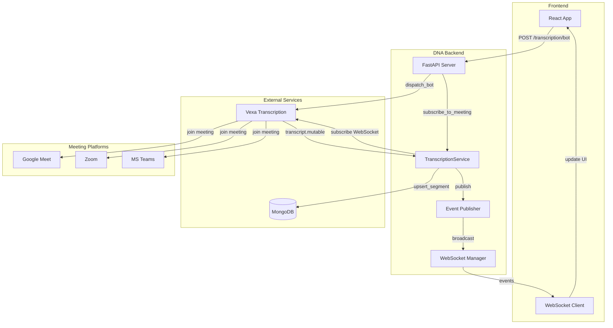
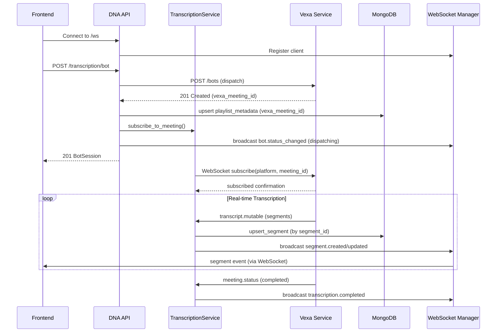
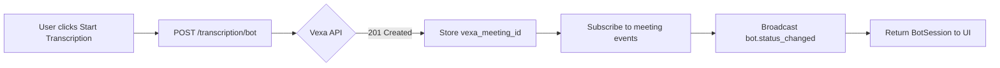
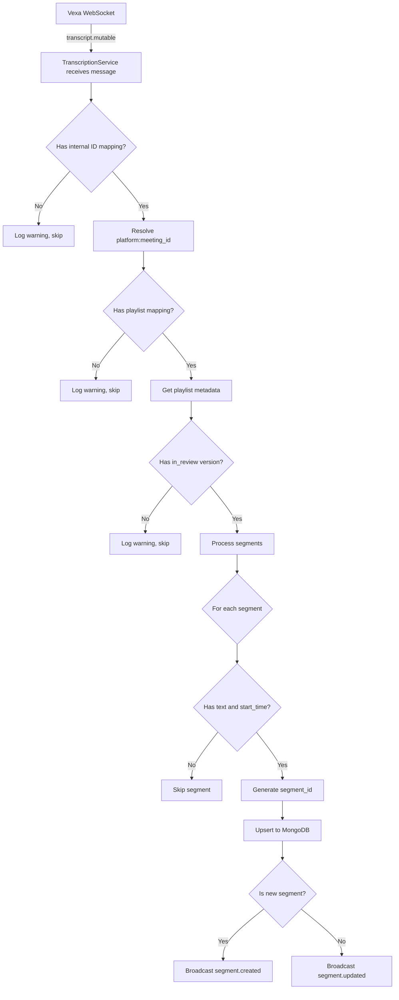
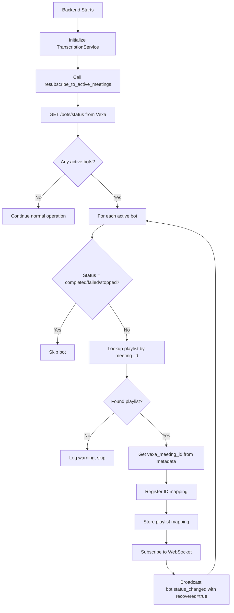

# Transcription Pipeline Documentation

This document describes the real-time transcription pipeline that integrates DNA with Vexa for meeting transcription, segment persistence, and event-driven UI updates.

## Table of Contents

1. [Overview](#overview)
2. [Architecture](#architecture)
3. [Components](#components)
4. [Data Flow](#data-flow)
5. [Event System](#event-system)
6. [Data Models](#data-models)
7. [Recovery Mechanisms](#recovery-mechanisms)
8. [API Reference](#api-reference)
9. [Configuration](#configuration)

---

## Overview

The transcription pipeline enables real-time meeting transcription by:

1. **Dispatching bots** to join meetings (Google Meet, Zoom, Teams)
2. **Receiving real-time transcripts** via WebSocket from Vexa
3. **Persisting segments** to MongoDB with unique IDs
4. **Broadcasting events** to connected frontend clients via WebSocket
5. **Recovering gracefully** from backend restarts

```
┌─────────────────┐     ┌─────────────────┐     ┌─────────────────┐
│    Frontend     │◀───▶│    DNA API      │────▶│     MongoDB     │
│     (React)     │ WS  │    (FastAPI)    │     │    (segments)   │
└─────────────────┘     └────────┬────────┘     └─────────────────┘
                                 │
                                 │ WebSocket
                                 ▼
                        ┌─────────────────┐
                        │      Vexa       │
                        │  (transcribe)   │
                        └─────────────────┘
```

---

## Architecture

### High-Level Architecture



### Component Interaction Sequence



---

## Components

### 1. DNA API (FastAPI)

The API server handles HTTP requests, WebSocket connections, and orchestrates the transcription flow.

**Key Endpoints:**
- `POST /transcription/bot` - Dispatch a bot to a meeting
- `DELETE /transcription/bot/{platform}/{meeting_id}` - Stop a bot
- `GET /ws` - WebSocket endpoint for real-time events

**Responsibilities:**
- Validate requests
- Call Vexa API to dispatch/stop bots
- Store `vexa_meeting_id` in playlist metadata
- Manage WebSocket connections for event broadcasting

### 2. TranscriptionService

An integrated service within the FastAPI process that manages Vexa WebSocket connections.

**Responsibilities:**
- Subscribe to meeting transcripts via WebSocket
- Process incoming transcript segments
- Generate unique segment IDs
- Persist segments to MongoDB
- Publish events to connected clients
- Recover subscriptions on restart

**Key Methods:**
| Method | Description |
|--------|-------------|
| `subscribe_to_meeting` | Subscribe to a meeting's WebSocket feed |
| `on_transcription_updated` | Process and persist transcript segments |
| `_on_vexa_event` | Handle Vexa events and publish to clients |
| `resubscribe_to_active_meetings` | Recovery on startup |

### 3. EventPublisher & WebSocketManager

Handles in-memory event publishing and WebSocket broadcasting.

**Features:**
- In-memory pub/sub for internal events
- WebSocket connection management
- Automatic broadcast to all connected clients
- Connection cleanup on disconnect

```
┌────────────────────────────────────────────────────────────────┐
│                         EventPublisher                          │
├────────────────────────────────────────────────────────────────┤
│  subscribe(event_type, callback)  → () => void (unsubscribe)   │
│  publish(event_type, payload)     → broadcasts to:             │
│     ├── Internal subscribers (TranscriptionService, etc.)      │
│     └── WebSocket clients (via WebSocketManager)               │
├────────────────────────────────────────────────────────────────┤
│                       WebSocketManager                          │
├────────────────────────────────────────────────────────────────┤
│  connect(websocket)     → Accept and register client           │
│  disconnect(websocket)  → Remove client from registry          │
│  broadcast(message)     → Send JSON to all connected clients   │
└────────────────────────────────────────────────────────────────┘
```

### 4. Vexa Transcription Provider

Abstraction layer for Vexa API interactions.

**Features:**
- HTTP client for REST API (`/bots`, `/bots/status`)
- WebSocket client for real-time transcripts
- Internal meeting ID mapping for transcript routing

```
┌────────────────────────────────────────────────────────────────┐
│                    VexaTranscriptionProvider                    │
├────────────────────────────────────────────────────────────────┤
│  REST API (httpx)                                              │
│  ├── POST /bots          → dispatch_bot()                      │
│  ├── DELETE /bots/:id    → stop_bot()                          │
│  └── GET /bots/status    → get_active_bots()                   │
├────────────────────────────────────────────────────────────────┤
│  WebSocket (websockets)                                        │
│  ├── ws://vexa/ws?api_key=xxx                                  │
│  ├── subscribe message   → subscribe_to_meeting()              │
│  ├── transcript.mutable  → callback(segments)                  │
│  ├── meeting.status      → callback(status)                    │
│  └── subscribed          → internal ID mapping                 │
├────────────────────────────────────────────────────────────────┤
│  Internal State                                                │
│  ├── _meeting_id_to_key: {internal_id → "platform:native_id"}  │
│  ├── _callbacks: {meeting_key → callback_function}             │
│  └── _pending_subscriptions: [meeting_keys awaiting confirm]   │
└────────────────────────────────────────────────────────────────┘
```

### 5. MongoDB Storage Provider

Handles all database operations for playlist metadata and segments.

**Collections:**
- `playlist_metadata` - Links playlists to meetings and versions
- `segments` - Stores transcription segments

---

## Data Flow

### 1. Bot Dispatch Flow



### 2. Transcript Processing Flow



### 3. Segment ID Generation

Segments are uniquely identified by a hash of:

```
segment_id = SHA256(playlist_id:version_id:speaker:absolute_start_time)[:16]
```

This ensures:
- Same speaker at same time = same segment (updates merge)
- Different speakers at same time = different segments
- Same speaker at different times = different segments

```
┌─────────────────────────────────────────────────────────────┐
│                    Segment ID Generation                     │
├─────────────────────────────────────────────────────────────┤
│  Input:                                                      │
│    playlist_id: 42                                           │
│    version_id: 5                                             │
│    speaker: "John Doe"                                       │
│    absolute_start_time: "2026-01-23T04:00:00.000Z"          │
│                                                              │
│  Hash Input: "42:5:John Doe:2026-01-23T04:00:00.000Z"       │
│                                                              │
│  Output: "a3f2b1c4d5e6f7a8" (first 16 chars of SHA256)      │
└─────────────────────────────────────────────────────────────┘
```

---

## Event System

### Event Types

| Event Type | Publisher | Consumer | Description |
|------------|-----------|----------|-------------|
| `bot.status_changed` | API/TranscriptionService | Frontend | Bot status update |
| `segment.created` | TranscriptionService | Frontend | New segment persisted |
| `segment.updated` | TranscriptionService | Frontend | Existing segment updated |
| `transcription.completed` | TranscriptionService | Frontend | Meeting ended |
| `transcription.error` | TranscriptionService | Frontend | Transcription failed |
| `playlist.updated` | API | Frontend | Playlist metadata changed |
| `version.updated` | API | Frontend | Version data changed |

### Event Flow Diagram

```
                       DNA API WebSocket (/ws)
                       ═════════════════════════
                                 │
           ┌─────────────────────┼─────────────────────┐
           │                     │                     │
           ▼                     ▼                     ▼
    ┌──────────────┐      ┌──────────────┐      ┌──────────────┐
    │   segment.   │      │    bot.      │      │transcription.│
    │   created    │      │status_changed│      │  completed   │
    │              │      │              │      │              │
    │ {segment_id, │      │ {status,     │      │ {platform,   │
    │  playlist_id,│      │  platform,   │      │  meeting_id} │
    │  version_id, │      │  meeting_id, │      │              │
    │  text,       │      │  playlist_id,│      └──────────────┘
    │  speaker,    │      │  recovered}  │             │
    │  start_time} │      └──────────────┘             │
    └──────────────┘             │                     ▼
           │                     │              Frontend UI
           ▼                     ▼              shows status
      Frontend UI           Frontend UI
    displays/updates      shows bot status
      segments
```

### Message Format

Events are sent as JSON over WebSocket:

```json
{
  "type": "segment.created",
  "payload": {
    "segment_id": "a3f2b1c4d5e6f7a8",
    "playlist_id": 42,
    "version_id": 5,
    "text": "Hello, this is a test.",
    "speaker": "John Doe",
    "absolute_start_time": "2026-01-23T04:00:00.000Z",
    "absolute_end_time": "2026-01-23T04:00:05.000Z"
  }
}
```

### Vexa WebSocket Messages

**transcript.mutable** (from Vexa):
```json
{
  "type": "transcript.mutable",
  "meeting": {"id": 123},
  "segments": [
    {
      "text": "Hello, this is a test.",
      "speaker": "John Doe",
      "language": "en",
      "absolute_start_time": "2026-01-23T04:00:00.000Z",
      "absolute_end_time": "2026-01-23T04:00:05.000Z",
      "updated_at": "2026-01-23T04:00:05.000Z"
    }
  ]
}
```

---

## Data Models

### PlaylistMetadata

Stored in MongoDB `playlist_metadata` collection:

```typescript
interface PlaylistMetadata {
  _id: string;
  playlist_id: number;
  in_review: number | null;      // Version ID currently in review
  meeting_id: string | null;     // Native meeting ID (e.g., "abc-def-ghi")
  platform: string | null;       // "google_meet", "zoom", "teams"
  vexa_meeting_id: number | null; // Internal Vexa meeting ID
}
```

### StoredSegment

Stored in MongoDB `segments` collection:

```typescript
interface StoredSegment {
  _id: string;
  segment_id: string;           // Generated unique ID
  playlist_id: number;
  version_id: number;
  text: string;
  speaker: string | null;
  language: string | null;
  absolute_start_time: string;  // ISO 8601 UTC timestamp
  absolute_end_time: string;    // ISO 8601 UTC timestamp
  vexa_updated_at: string | null;
  created_at: datetime;
  updated_at: datetime;
}
```

### BotSession

Returned from dispatch_bot API:

```typescript
interface BotSession {
  platform: "google_meet" | "zoom" | "teams";
  meeting_id: string;
  playlist_id: number;
  status: "joining" | "waiting" | "in_meeting" | "completed" | "failed";
  vexa_meeting_id: number | null;
  bot_name: string | null;
  language: string | null;
  created_at: datetime;
  updated_at: datetime;
}
```

---

## Recovery Mechanisms

### Backend Restart Recovery

When the backend restarts mid-meeting, it recovers active subscriptions:



### Internal Meeting ID Mapping

Vexa uses internal meeting IDs in transcript messages, but DNA uses platform:native_id. The mapping is maintained through:

1. **At dispatch time**: `vexa_meeting_id` returned from Vexa is stored in playlist metadata
2. **At recovery time**: Load from playlist metadata or bot status response
3. **At runtime**: Captured from `subscribed` and `meeting.status` WebSocket messages

---

## API Reference

### POST /transcription/bot

Dispatch a transcription bot to a meeting.

**Request:**
```json
{
  "platform": "google_meet",
  "meeting_id": "abc-def-ghi",
  "playlist_id": 42,
  "passcode": "optional",
  "bot_name": "DNA Bot",
  "language": "en"
}
```

**Response (201):**
```json
{
  "platform": "google_meet",
  "meeting_id": "abc-def-ghi",
  "playlist_id": 42,
  "status": "joining",
  "vexa_meeting_id": 123,
  "bot_name": "DNA Bot",
  "language": "en",
  "created_at": "2026-01-23T04:00:00Z",
  "updated_at": "2026-01-23T04:00:00Z"
}
```

### DELETE /transcription/bot/{platform}/{meeting_id}

Stop a transcription bot.

**Response (200):**
```json
true
```

### WebSocket /ws

Connect to receive real-time events.

**Connection:**
```javascript
const ws = new WebSocket('ws://localhost:8000/ws');
ws.onmessage = (event) => {
  const data = JSON.parse(event.data);
  console.log(data.type, data.payload);
};
```

---

## Configuration

### Environment Variables

| Variable | Default | Description |
|----------|---------|-------------|
| `VEXA_API_URL` | `http://vexa:8056` | Vexa REST API base URL |
| `VEXA_WS_URL` | `ws://vexa:8056/ws` | Vexa WebSocket URL |
| `VEXA_API_KEY` | (required) | API key for Vexa authentication |
| `MONGODB_URL` | `mongodb://localhost:27017` | MongoDB connection URL |
| `MONGODB_DB` | `dna` | MongoDB database name |

### Frontend Environment Variables

| Variable | Default | Description |
|----------|---------|-------------|
| `VITE_WS_URL` | `ws://localhost:8000/ws` | Backend WebSocket URL |
| `VITE_API_BASE_URL` | `http://localhost:8000` | Backend API URL |

---

## Testing

The transcription service has comprehensive test coverage:

```bash
# Run all tests
make test

# Run transcription service tests only
pytest tests/test_transcription_service.py -v

# Run WebSocket tests
pytest tests/test_websocket.py -v
```

### Test Categories

| Category | Tests | Description |
|----------|-------|-------------|
| `TestSubscribeToMeeting` | 5 | Subscription handling |
| `TestOnTranscriptionUpdated` | 6 | Segment processing |
| `TestOnVexaEvent` | 4 | Vexa event forwarding |
| `TestResubscribeToActiveMeetings` | 10 | Recovery logic |
| `TestSegmentIdGeneration` | 5 | ID generation |
| `TestWebSocketEndpoint` | 5 | WebSocket broadcasting |

---

## Troubleshooting

### Common Issues

#### "Received transcript for unknown internal meeting ID"

**Cause:** The internal Vexa meeting ID wasn't mapped before transcripts arrived.

**Solution:** Ensure:
1. `vexa_meeting_id` is stored in playlist metadata at dispatch time
2. Backend loads mapping on restart via `resubscribe_to_active_meetings()`

#### "No playlist_id found for meeting"

**Cause:** The meeting_key → playlist_id mapping is missing.

**Solution:** Check that:
1. `subscribe_to_meeting()` is called with correct `playlist_id`
2. Service stores mapping in `_meeting_to_playlist`

#### "No in_review version found for playlist"

**Cause:** The playlist doesn't have an active in-review version.

**Solution:** Set `playlist_metadata.in_review` to a valid version ID before starting transcription.

#### WebSocket not receiving events

**Cause:** Client not connected to `/ws` endpoint.

**Solution:**
1. Verify WebSocket connection to `ws://localhost:8000/ws`
2. Check browser console for connection errors
3. Ensure backend is running and healthy

### Debug Logging

Enable debug logging for detailed transcript processing:

```python
import logging
logging.getLogger("dna.transcription_service").setLevel(logging.DEBUG)
logging.getLogger("dna.transcription_providers.vexa").setLevel(logging.DEBUG)
```

---

## Architecture Decision Records

### ADR-001: Segment ID Generation

**Decision:** Use SHA256 hash of `playlist_id:version_id:speaker:absolute_start_time`

**Rationale:**
- Ensures idempotent upserts (same data = same ID)
- Allows updating segment text as speaker continues
- No coordination needed between distributed components

### ADR-002: Store vexa_meeting_id in MongoDB

**Decision:** Persist Vexa's internal meeting ID in playlist_metadata

**Rationale:**
- Required for service recovery after restart
- WebSocket `subscribed` response doesn't always include internal ID
- Eliminates dependency on Vexa API response format

### ADR-003: WebSocket API Gateway

**Decision:** Use native WebSocket at `/ws` for real-time event broadcasting

**Rationale:**
- Simpler architecture (no external message broker)
- Direct communication between backend and frontend
- Reduced operational complexity
- Lower latency for real-time events
